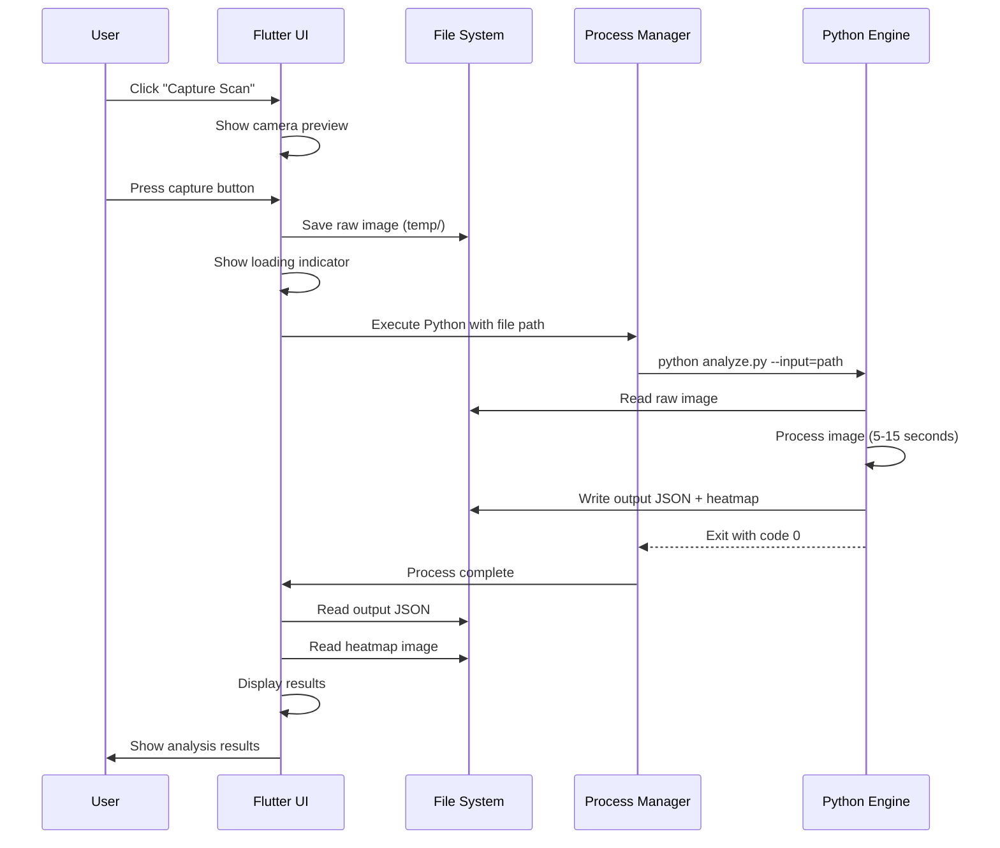
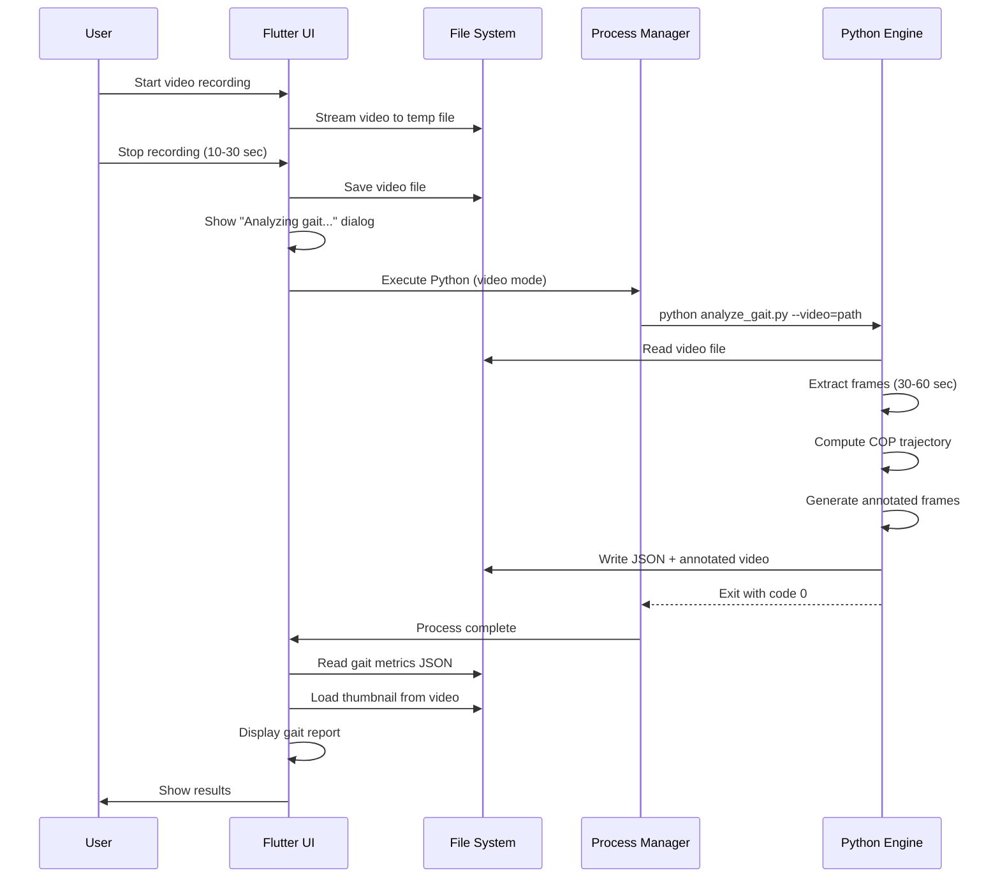
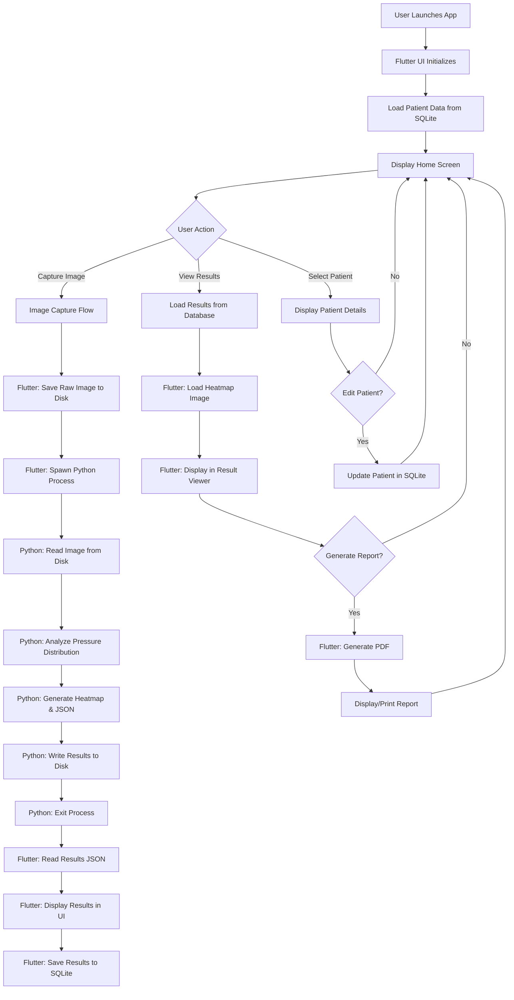
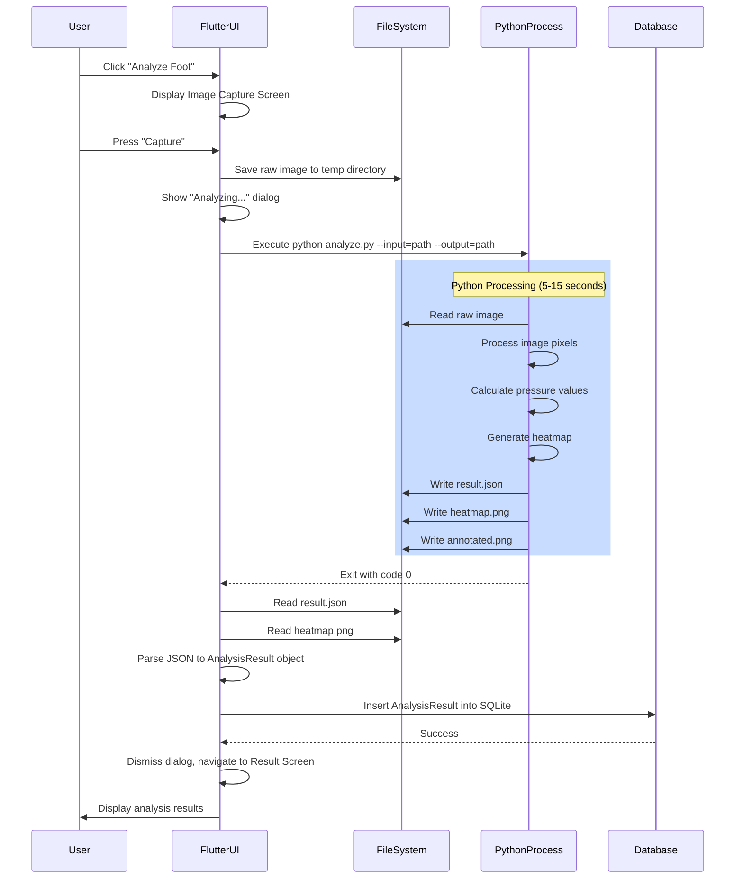
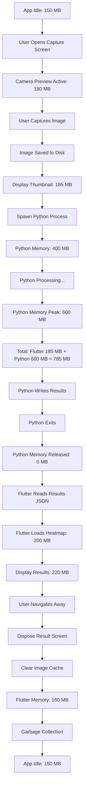
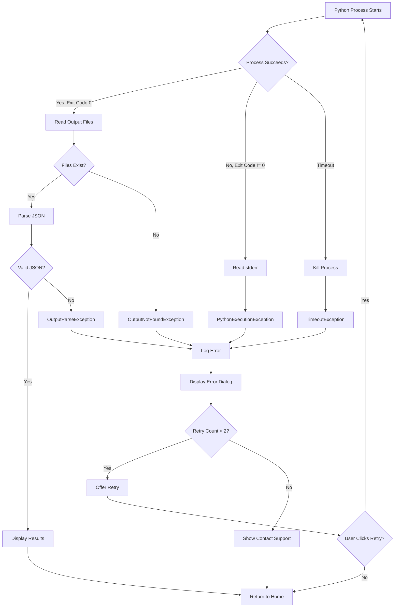

# Technical Documentation and Implementation Plan
## Clinical Plantar Analysis Desktop Application

**Version:** 1.0  
**Target Platform:** Windows Desktop (Primary)  
**Last Updated:** January 2026  
**Document Status:** Implementation Ready

---

## 1. System Overview

### 1.1 High-Level Explanation

This Clinical Plantar Analysis System is a Windows-first desktop application designed for clinical environments to capture, analyze, and report on plantar pressure distribution and foot biomechanics. The system processes static and dynamic foot pressure data to assist healthcare professionals in diagnosing foot conditions, prescribing appropriate interventions, and tracking patient progress over time.

The application architecture is built on a **separation of concerns** principle:
- **Flutter Desktop** serves as the presentation and orchestration layer
- **Python Engine** handles all computationally intensive tasks including image processing, pressure analysis, and machine learning inference
- **Node.js Backend** (optional) provides cloud synchronization and multi-clinic data management

### 1.2 Role Distribution

#### Flutter Desktop Responsibilities
- User interface rendering and interaction
- Patient data management (CRUD operations)
- Image/video capture orchestration
- File system operations
- Local database management (SQLite)
- Result visualization (displaying processed images and metrics)
- Report generation coordination
- Python process lifecycle management
- Error handling and user feedback
- Navigation and state management

#### Python Analytics Engine Responsibilities
- Raw image/video processing
- Pressure map generation from scan data
- Foot region segmentation (heel, midfoot, forefoot, toes)
- Peak pressure calculation per region
- Pressure-time integral computation
- Center of pressure (COP) trajectory analysis
- Gait analysis from video sequences
- Comparison analysis (pre/post treatment, left/right foot)
- Machine learning model inference
- Heatmap overlay generation
- Export of processed images and JSON metrics

#### Node.js Backend Responsibilities (Optional)
- Multi-clinic patient data synchronization
- User authentication and authorization
- Centralized report storage
- Analytics aggregation across patients
- Backup and disaster recovery
- API for mobile companion apps (future)

### 1.3 Why Flutter for Desktop UI

Flutter Desktop was selected for the following technical reasons:

1. **Single Codebase**: Write once, deploy to Windows, macOS, and Linux with minimal platform-specific code
2. **Modern UI Framework**: Declarative UI with reactive state management eliminates manual UI synchronization
3. **Native Performance**: Compiled to native machine code, no JavaScript bridge overhead
4. **Rich Widget Library**: Material Design and Cupertino widgets accelerate development
5. **Strong Typing**: Dart's sound null safety reduces runtime errors
6. **Hot Reload**: Rapid iteration during development without full rebuilds
7. **Growing Ecosystem**: Access to packages for SQLite, file pickers, printing, PDF generation, etc.
8. **Medical Device Readiness**: Flutter's deterministic rendering and testability support regulatory requirements (IEC 62304)

### 1.4 Why File-Path–Based Integration

The decision to use file-path–based communication between Flutter and Python (instead of in-memory pipes or FFI) is driven by:

1. **Simplicity**: No complex inter-process communication protocols
2. **Debuggability**: All intermediate data is persisted and inspectable
3. **Fault Tolerance**: If Python crashes, Flutter can retry without data loss
4. **Language Independence**: No need for language bindings or FFI complexity
5. **Regulatory Traceability**: File-based audit trail for medical device compliance
6. **Memory Isolation**: Python's memory usage doesn't affect Flutter's heap
7. **Scalability**: Easy to distribute processing to remote servers in future
8. **Testability**: Can test Python engine independently with pre-recorded inputs

---

## 2. Technology Stack

### 2.1 Flutter Desktop (Windows)

**Version:** Flutter 3.19+ (Stable Channel)  
**Dart SDK:** 3.3+

**Core Packages:**
- `sqflite_common_ffi` - Local SQLite database
- `path_provider` - File system paths
- `file_picker` - File selection dialogs
- `camera_windows` - Camera access (if using USB cameras)
- `image_picker` - Gallery image selection
- `process_run` - Python process execution
- `riverpod` / `provider` - State management
- `go_router` - Navigation
- `intl` - Internationalization
- `pdf` - Report generation
- `printing` - Printer access
- `flutter_form_builder` - Form handling
- `charts_flutter` - Data visualization

**Development Tools:**
- `build_runner` - Code generation
- `flutter_launcher_icons` - Icon generation
- `msix` - Windows installer packaging

### 2.2 Python Analytics Engine

**Version:** Python 3.11+

**Core Libraries:**
- `opencv-python` (4.9+) - Image processing
- `numpy` (1.26+) - Numerical operations
- `scipy` (1.12+) - Scientific computing
- `scikit-image` (0.22+) - Advanced image algorithms
- `pandas` (2.2+) - Data manipulation
- `matplotlib` (3.8+) - Visualization
- `Pillow` (10.2+) - Image I/O
- `torch` or `tensorflow-lite` - ML inference (optional)

**Distribution:**
- Package as embedded Python runtime using `PyInstaller` or `cx_Freeze`
- Include all dependencies in distribution
- No external Python installation required

### 2.3 Node.js Backend (Optional)

**Version:** Node.js 20 LTS

**Framework:** Fastify or Express.js

**Database:** PostgreSQL 16+

**Key Libraries:**
- `bcrypt` - Password hashing
- `jsonwebtoken` - JWT authentication
- `multer` - File uploads
- `pg` - PostgreSQL client
- `winston` - Logging

**Deployment:** Docker containers on cloud VPS or on-premises server

### 2.4 Local Storage & Database

**Database:** SQLite (via `sqflite_common_ffi`)

**File Storage Structure:**
```
AppData/
  Local/
    PlanterAnalysis/
      database/
        app.db
      patients/
        {patient_id}/
          images/
            raw/
            processed/
          videos/
          reports/
      temp/
      logs/
      config.json
```

**Database Schema (Key Tables):**
- `patients` - Patient demographic data
- `sessions` - Analysis sessions
- `measurements` - Raw measurement data
- `results` - Processed analysis results
- `reports` - Generated reports metadata
- `sync_queue` - Pending sync operations

---

## 3. Application Architecture

### 3.1 Component-Level Architecture

```
┌─────────────────────────────────────────────────────────────┐
│                     Flutter Desktop UI                      │
│  ┌────────────┐  ┌─────────────┐  ┌──────────────────────┐ │
│  │  Capture   │  │   Patient   │  │   Analysis Results   │ │
│  │  Screens   │  │ Management  │  │      Viewer          │ │
│  └─────┬──────┘  └──────┬──────┘  └──────────┬───────────┘ │
│        │                │                     │             │
│        └────────────────┴─────────────────────┘             │
│                         │                                   │
│                    ┌────▼─────┐                             │
│                    │  State   │                             │
│                    │Management│                             │
│                    └────┬─────┘                             │
│                         │                                   │
│        ┌────────────────┼────────────────┐                  │
│        │                │                │                  │
│   ┌────▼────┐     ┌─────▼─────┐   ┌─────▼──────┐          │
│   │  File   │     │  SQLite   │   │  Process   │          │
│   │  System │     │  Database │   │  Manager   │          │
│   └────┬────┘     └─────┬─────┘   └─────┬──────┘          │
└────────┼──────────────────┼───────────────┼─────────────────┘
         │                  │               │
         │                  │               │ Execute
         │ Read/Write Files │               │
         │                  │               │
┌────────▼──────────────────▼───────────────▼─────────────────┐
│                   Operating System                          │
│                    (Windows 10/11)                          │
└────────┬──────────────────────────────────┬─────────────────┘
         │                                  │
         │ File Paths                       │ Spawn Process
         │ as Arguments                     │
         │                                  │
    ┌────▼──────────────────────────────────▼────┐
    │         Python Analytics Engine             │
    │  ┌──────────┐  ┌──────────┐  ┌──────────┐  │
    │  │  Image   │  │ Pressure │  │  Gait    │  │
    │  │Processing│  │ Analysis │  │ Analysis │  │
    │  └────┬─────┘  └────┬─────┘  └────┬─────┘  │
    │       │             │             │        │
    │       └─────────────┴─────────────┘        │
    │                     │                      │
    │           ┌─────────▼─────────┐            │
    │           │  Output Generator │            │
    │           │ (JSON + Images)   │            │
    │           └─────────┬─────────┘            │
    └─────────────────────┼──────────────────────┘
                          │
                          │ Write to Disk
                          │
                    ┌─────▼─────┐
                    │   File    │
                    │  System   │
                    └─────┬─────┘
                          │
                          │ Poll/Read
                          │
                    ┌─────▼─────┐
                    │  Flutter  │
                    │   Reads   │
                    │  Results  │
                    └───────────┘

Optional Backend Sync:
┌─────────────────────────────────────────────────────────────┐
│                  Flutter Desktop UI                         │
└────────────┬────────────────────────────────────────────────┘
             │ HTTPS POST (When online)
             │
        ┌────▼──────────────────────┐
        │   Node.js REST API        │
        │  (JWT Authentication)     │
        └────┬──────────────────────┘
             │
        ┌────▼──────────────────────┐
        │   PostgreSQL Database     │
        │  (Multi-tenant)           │
        └───────────────────────────┘
```

### 3.2 Data Flow: Capture → Analysis → Result

#### 3.2.1 Image Capture Flow



#### 3.2.2 Video Analysis Flow



#### 3.2.3 Comparison Analysis Flow

```
User selects two sessions → Flutter reads both result JSONs from database
→ Flutter UI renders side-by-side comparison (NO Python call needed)
→ Display pressure difference heatmap (pre-computed by Python)
```

### 3.3 Separation of Concerns

| Concern | Flutter Responsibility | Python Responsibility |
|---------|------------------------|----------------------|
| **Image Capture** | Use camera API, save to disk | None |
| **Image Display** | Load and render images | None |
| **Pixel Processing** | None | All processing |
| **Pressure Calculation** | None | All algorithms |
| **Data Storage** | SQLite CRUD operations | None |
| **UI State** | Full control | None |
| **File Management** | Path generation, cleanup | Read/write at given paths |
| **Error Handling** | User-facing messages | Exit codes + error JSON |
| **Report Layout** | PDF rendering | None (provides data only) |

### 3.4 Process Lifecycle Management

**Python Process States:**
```
IDLE → STARTING → RUNNING → COMPLETED/FAILED/TIMEOUT → CLEANUP
```

**Flutter Process Manager Responsibilities:**
1. Spawn Python process with `Process.start()`
2. Monitor stdout/stderr for progress logs
3. Implement timeout (configurable, default 120 seconds)
4. Handle process crashes (exit code != 0)
5. Kill zombie processes on timeout
6. Clean up temporary files after completion
7. Retry logic (up to 2 retries on failure)
8. Log all process executions for debugging

**Timeout Handling:**
```dart
final process = await Process.start('python', args);
final result = await process.exitCode.timeout(
  Duration(seconds: 120),
  onTimeout: () {
    process.kill();
    throw TimeoutException('Python process timed out');
  },
);
```

---

## 4. Flutter Desktop Architecture

### 4.1 Folder Structure

```
lib/
  ├── main.dart
  ├── app.dart
  ├── core/
  │   ├── constants/
  │   │   ├── app_constants.dart
  │   │   ├── file_paths.dart
  │   │   └── error_codes.dart
  │   ├── config/
  │   │   └── app_config.dart
  │   ├── di/
  │   │   └── injection.dart  // Dependency injection setup
  │   ├── errors/
  │   │   ├── exceptions.dart
  │   │   └── failures.dart
  │   └── utils/
  │       ├── file_utils.dart
  │       ├── date_utils.dart
  │       └── validators.dart
  ├── data/
  │   ├── models/
  │   │   ├── patient_model.dart
  │   │   ├── session_model.dart
  │   │   ├── measurement_model.dart
  │   │   └── result_model.dart
  │   ├── repositories/
  │   │   ├── patient_repository.dart
  │   │   ├── session_repository.dart
  │   │   └── result_repository.dart
  │   └── data_sources/
  │       ├── local/
  │       │   └── database_helper.dart
  │       └── remote/
  │           └── api_client.dart  // Optional
  ├── domain/
  │   ├── entities/
  │   │   ├── patient.dart
  │   │   ├── session.dart
  │   │   ├── measurement.dart
  │   │   └── analysis_result.dart
  │   ├── repositories/
  │   │   └── [interfaces for repositories]
  │   └── usecases/
  │       ├── capture_image_usecase.dart
  │       ├── analyze_pressure_usecase.dart
  │       └── generate_report_usecase.dart
  ├── presentation/
  │   ├── router/
  │   │   └── app_router.dart
  │   ├── state/
  │   │   ├── providers/
  │   │   │   ├── patient_provider.dart
  │   │   │   ├── session_provider.dart
  │   │   │   └── analysis_provider.dart
  │   │   └── notifiers/
  │   │       └── app_state_notifier.dart
  │   ├── screens/
  │   │   ├── home/
  │   │   │   ├── home_screen.dart
  │   │   │   └── home_view_model.dart
  │   │   ├── patient/
  │   │   │   ├── patient_list_screen.dart
  │   │   │   ├── patient_detail_screen.dart
  │   │   │   └── add_patient_screen.dart
  │   │   ├── capture/
  │   │   │   ├── image_capture_screen.dart
  │   │   │   ├── video_capture_screen.dart
  │   │   │   └── capture_view_model.dart
  │   │   ├── analysis/
  │   │   │   ├── analysis_screen.dart
  │   │   │   ├── analysis_result_screen.dart
  │   │   │   └── comparison_screen.dart
  │   │   └── reports/
  │   │       ├── report_list_screen.dart
  │   │       └── report_viewer_screen.dart
  │   └── widgets/
  │       ├── common/
  │       │   ├── app_button.dart
  │       │   ├── app_text_field.dart
  │       │   └── loading_indicator.dart
  │       ├── patient/
  │       │   └── patient_card.dart
  │       └── analysis/
  │           ├── pressure_map_viewer.dart
  │           ├── metrics_card.dart
  │           └── comparison_view.dart
  └── services/
      ├── python_service.dart
      ├── file_service.dart
      ├── camera_service.dart
      ├── print_service.dart
      └── sync_service.dart  // Optional

test/
  ├── unit/
  ├── widget/
  └── integration/

assets/
  ├── images/
  ├── fonts/
  └── config/
      └── python_engine/
          ├── analyze.py
          ├── analyze_gait.py
          └── requirements.txt
```

### 4.2 UI Layer Responsibilities

**Screen-Level Responsibilities:**
- Render UI components
- Handle user input
- Trigger business logic via ViewModels/Providers
- Display loading/error states
- Navigate to other screens

**Widget-Level Responsibilities:**
- Render reusable UI components
- Accept data via constructor parameters
- Emit events via callbacks
- No direct business logic

**ViewModel/Provider Responsibilities:**
- Execute use cases
- Maintain screen state
- Expose state to UI via `StateNotifier` or `ChangeNotifier`
- Handle errors and convert to UI-friendly messages
- Coordinate multiple services

### 4.3 State Management Strategy

**Primary Strategy:** Riverpod 2.x

**Rationale:**
- Compile-time safety (no `BuildContext` errors)
- Better testability than Provider
- Automatic disposal
- Async state handling out of the box
- DevTools integration

**State Management Layers:**

1. **Global Application State:**
   - Current patient
   - Active session
   - User preferences
   - Sync status

2. **Screen-Specific State:**
   - Form validation states
   - Loading indicators
   - Error messages

3. **Ephemeral Widget State:**
   - Animation controllers
   - Text field focus
   - Dropdown selections

**Example Provider:**
```dart
final analysisProvider = StateNotifierProvider<AnalysisNotifier, AnalysisState>((ref) {
  return AnalysisNotifier(
    pythonService: ref.read(pythonServiceProvider),
    resultRepository: ref.read(resultRepositoryProvider),
  );
});
```

### 4.4 Navigation Architecture

**Router:** `go_router` 7.x

**Route Structure:**
```
/ (HomeScreen)
  ├── /patients (PatientListScreen)
  │     ├── /patients/:id (PatientDetailScreen)
  │     └── /patients/new (AddPatientScreen)
  ├── /capture (CaptureMenuScreen)
  │     ├── /capture/image (ImageCaptureScreen)
  │     └── /capture/video (VideoCaptureScreen)
  ├── /analysis/:sessionId (AnalysisScreen)
  │     └── /analysis/:sessionId/result (ResultScreen)
  ├── /compare (ComparisonScreen)
  └── /reports (ReportListScreen)
        └── /reports/:id (ReportViewerScreen)
```

**Navigation Guards:**
- Check if patient is selected before allowing capture
- Confirm unsaved changes before navigation
- Prevent back navigation during analysis

### 4.5 Error Handling Approach

**Error Classification:**

1. **User Input Errors** (400-level)
   - Invalid form data
   - Missing required fields
   - Display inline validation messages

2. **System Errors** (500-level)
   - Python process crashes
   - File system errors
   - Database errors
   - Display error dialog with retry option

3. **Network Errors** (sync only)
   - Connection timeout
   - Server unavailable
   - Queue for later sync, show status banner

**Error Handling Flow:**
```dart
// In ViewModel
Future<void> analyzeImage(String imagePath) async {
  state = state.copyWith(isLoading: true, error: null);
  
  try {
    final result = await _pythonService.runAnalysis(imagePath);
    state = state.copyWith(
      isLoading: false,
      result: result,
    );
  } on PythonExecutionException catch (e) {
    state = state.copyWith(
      isLoading: false,
      error: 'Analysis failed: ${e.message}',
    );
    _logger.error('Python execution failed', error: e);
  } on TimeoutException catch (e) {
    state = state.copyWith(
      isLoading: false,
      error: 'Analysis timed out. Please try again.',
    );
  } catch (e) {
    state = state.copyWith(
      isLoading: false,
      error: 'Unexpected error occurred.',
    );
    _logger.error('Unexpected error', error: e);
  }
}
```

**User-Facing Error Messages:**
- Clear, non-technical language
- Actionable suggestions
- Retry button when applicable
- Contact support option for critical errors

---

## 5. Python Integration Strategy

### 5.1 Python Execution Model

**Bundled Python Runtime:**
- Python 3.11 embedded distribution included in Windows installer
- Located in `app_directory/python_runtime/`
- All dependencies pre-installed (no pip required at runtime)

**Script Invocation:**
```dart
final pythonExe = path.join(appDirectory, 'python_runtime', 'python.exe');
final scriptPath = path.join(appDirectory, 'scripts', 'analyze.py');

final process = await Process.start(
  pythonExe,
  [scriptPath, '--input', inputPath, '--output', outputPath],
  workingDirectory: appDirectory,
);
```

### 5.2 Argument Passing

**Command-Line Interface:**

```python
# analyze.py
import argparse

parser = argparse.ArgumentParser()
parser.add_argument('--input', required=True, help='Path to input image')
parser.add_argument('--output', required=True, help='Path to output directory')
parser.add_argument('--mode', default='static', choices=['static', 'dynamic'])
parser.add_argument('--sensitivity', type=int, default=50, help='Pressure sensitivity 0-100')
parser.add_argument('--config', help='Path to config JSON (optional)')
args = parser.parse_args()
```

**Flutter Invocation Example:**
```dart
await Process.run(pythonExe, [
  scriptPath,
  '--input', '/path/to/raw_image.png',
  '--output', '/path/to/output_dir',
  '--mode', 'static',
  '--sensitivity', '75',
]);
```

**Configuration via JSON:**
For complex configurations, pass a JSON config file:
```dart
final config = {
  'mode': 'static',
  'sensitivity': 75,
  'regions': ['heel', 'midfoot', 'forefoot', 'toes'],
  'generate_heatmap': true,
};
final configPath = path.join(tempDir, 'config.json');
await File(configPath).writeAsString(jsonEncode(config));

await Process.run(pythonExe, [
  scriptPath,
  '--input', inputPath,
  '--output', outputPath,
  '--config', configPath,
]);
```

### 5.3 Output Handling

**Expected Python Output Structure:**
```
output_dir/
  ├── result.json          # Primary output
  ├── heatmap.png          # Pressure heatmap
  ├── annotated.png        # Image with overlays
  ├── cop_trajectory.png   # COP path (optional)
  └── log.txt              # Processing log
```

**result.json Schema:**
```json
{
  "status": "success",
  "timestamp": "2026-01-12T10:30:00Z",
  "processing_time_seconds": 8.3,
  "metadata": {
    "input_resolution": [1920, 1080],
    "detected_foot_area_pixels": 125430,
    "analysis_mode": "static"
  },
  "metrics": {
    "total_force_n": 650.3,
    "total_area_cm2": 185.2,
    "average_pressure_kpa": 35.1,
    "regions": {
      "heel": {
        "peak_pressure_kpa": 250.5,
        "average_pressure_kpa": 180.2,
        "area_cm2": 45.3,
        "force_n": 220.1,
        "pressure_time_integral": 1250.3
      },
      "midfoot": { /* ... */ },
      "forefoot": { /* ... */ },
      "toes": { /* ... */ }
    },
    "left_right_ratio": 0.98,
    "cop_coordinates": {
      "x_cm": 8.5,
      "y_cm": 12.3
    }
  },
  "warnings": [
    "High pressure detected in heel region (>200 kPa)"
  ],
  "errors": []
}
```

**Flutter Output Parsing:**
```dart
class AnalysisResult {
  final String status;
  final DateTime timestamp;
  final double processingTime;
  final Map<String, dynamic> metadata;
  final PressureMetrics metrics;
  final List<String> warnings;
  final List<String> errors;
  
  factory AnalysisResult.fromJson(Map<String, dynamic> json) {
    return AnalysisResult(
      status: json['status'],
      timestamp: DateTime.parse(json['timestamp']),
      processingTime: json['processing_time_seconds'],
      metadata: json['metadata'],
      metrics: PressureMetrics.fromJson(json['metrics']),
      warnings: List<String>.from(json['warnings'] ?? []),
      errors: List<String>.from(json['errors'] ?? []),
    );
  }
}

// Usage
final resultFile = File(path.join(outputDir, 'result.json'));
final resultJson = jsonDecode(await resultFile.readAsString());
final result = AnalysisResult.fromJson(resultJson);
```

### 5.4 Failure & Timeout Handling

**Failure Scenarios:**

1. **Python Process Exits with Non-Zero Code:**
```dart
final exitCode = await process.exitCode;
if (exitCode != 0) {
  final stderr = await process.stderr.transform(utf8.decoder).join();
  throw PythonExecutionException(
    'Python process failed with exit code $exitCode',
    stderr: stderr,
  );
}
```

2. **Timeout (No Response After 120s):**
```dart
final exitCode = await process.exitCode.timeout(
  Duration(seconds: 120),
  onTimeout: () {
    process.kill(ProcessSignal.sigterm);
    throw TimeoutException('Python analysis timed out after 120 seconds');
  },
);
```

3. **Missing Output Files:**
```dart
final resultFile = File(path.join(outputDir, 'result.json'));
if (!await resultFile.exists()) {
  throw OutputNotFoundException('Expected result.json not found');
}
```

4. **Malformed JSON Output:**
```dart
try {
  final json = jsonDecode(await resultFile.readAsString());
  return AnalysisResult.fromJson(json);
} on FormatException catch (e) {
  throw OutputParseException('Invalid JSON in result.json', cause: e);
}
```

**Retry Logic:**
```dart
Future<AnalysisResult> runAnalysisWithRetry(
  String inputPath,
  String outputPath, {
  int maxRetries = 2,
}) async {
  int attempt = 0;
  while (attempt <= maxRetries) {
    try {
      return await _runAnalysis(inputPath, outputPath);
    } on PythonExecutionException catch (e) {
      if (attempt == maxRetries) rethrow;
      _logger.warning('Analysis failed (attempt ${attempt + 1}), retrying...');
      attempt++;
      await Future.delayed(Duration(seconds: 2));
    }
  }
  throw Exception('Unreachable');
}
```

**Error Recovery Actions:**
- Display error message to user
- Offer "Retry" button
- Log error details for support
- Optionally queue for later processing (if due to transient issue)

### 5.5 Process Cleanup

**Cleanup Checklist:**
1. Ensure process is killed if app closes during analysis
2. Delete temporary files after successful analysis
3. Archive or delete failed analysis artifacts
4. Release file handles

**Implementation:**
```dart
class PythonService {
  Process? _currentProcess;

  Future<AnalysisResult> runAnalysis(String inputPath) async {
    final outputDir = await _createTempOutputDir();
    
    try {
      _currentProcess = await Process.start(pythonExe, [/* ... */]);
      final exitCode = await _currentProcess!.exitCode.timeout(/* ... */);
      
      if (exitCode != 0) throw PythonExecutionException(/* ... */);
      
      final result = await _parseOutput(outputDir);
      await _archiveOutputs(outputDir); // Move to permanent storage
      return result;
    } catch (e) {
      await _cleanupFailedAnalysis(outputDir);
      rethrow;
    } finally {
      _currentProcess = null;
    }
  }

  Future<void> dispose() async {
    if (_currentProcess != null) {
      _currentProcess!.kill(ProcessSignal.sigterm);
      await _currentProcess!.exitCode.timeout(
        Duration(seconds: 5),
        onTimeout: () {
          _currentProcess!.kill(ProcessSignal.sigkill); // Force kill
          return -1;
        },
      );
    }
  }

  Future<void> _cleanupFailedAnalysis(Directory outputDir) async {
    try {
      if (await outputDir.exists()) {
        await outputDir.delete(recursive: true);
      }
    } catch (e) {
      _logger.error('Failed to cleanup temp directory', error: e);
    }
  }
}
```

---

## 6. Image & Video Handling Rules

### 6.1 Image Capture Strategy

**Capture Resolution Tiers:**

| Mode | Resolution | File Size (est.) | Use Case |
|------|------------|------------------|----------|
| Preview | 640x480 | ~50 KB | Live camera feed |
| Standard | 1920x1080 | ~500 KB | Routine analysis |
| High-Res | 3840x2160 (4K) | ~2 MB | Research/detailed cases |

**Capture Implementation:**
```dart
Future<File> captureImage({
  required CaptureResolution resolution,
}) async {
  final camera = await _cameraService.initialize();
  
  // Set resolution
  await camera.setResolution(resolution.toSize());
  
  // Capture
  final XFile xFile = await camera.takePicture();
  
  // Save to permanent location
  final timestamp = DateTime.now().millisecondsSinceEpoch;
  final fileName = 'raw_${timestamp}.png';
  final targetPath = path.join(
    await _fileService.getPatientsDir(),
    currentPatientId,
    'images',
    'raw',
    fileName,
  );
  
  final savedFile = await xFile.saveTo(targetPath);
  return savedFile;
}
```

**CRITICAL RULE:** Flutter must save images in lossless format (PNG) to preserve pressure data fidelity. NEVER use JPEG for raw captures.

### 6.2 Resolution Control

**Configuration File** (`config.json`):
```json
{
  "capture": {
    "default_resolution": "1920x1080",
    "max_resolution": "3840x2160",
    "preview_resolution": "640x480",
    "format": "png",
    "compression_level": 0
  }
}
```

**Resolution Selection UI:**
- Allow clinicians to select resolution per capture
- Display storage impact estimate
- Default to Standard (1920x1080) for balance

### 6.3 Preview vs Full-Resolution Separation

**Two-Stage Capture Process:**

1. **Preview Stage (Flutter UI):**
   - Display live camera feed at 640x480
   - Overlay alignment guides
   - Enable user to position foot correctly
   - **No image processing, just display**

2. **Full-Resolution Capture (Flutter → Python):**
   - Capture at configured resolution (e.g., 1920x1080)
   - Save to disk
   - Pass to Python for analysis
   - Display thumbnail + loading indicator while processing

**Preview Widget:**
```dart
CameraPreview(
  controller: _cameraController,
  child: Stack(
    children: [
      CustomPaint(
        painter: FootAlignmentGuidePainter(), // Overlay guide
      ),
      Align(
        alignment: Alignment.bottomCenter,
        child: CaptureButton(onPressed: _captureFullResolution),
      ),
    ],
  ),
)
```

### 6.4 Video Handling Limitations

**Video Constraints:**
- **Maximum Duration:** 30 seconds (configurable, default 15s)
- **Frame Rate:** 30 FPS
- **Resolution:** 1280x720 (720p) - balance between quality and file size
- **Codec:** H.264 (MP4 container)
- **Maximum File Size:** ~50 MB per video

**Flutter Video Capture:**
```dart
Future<File> captureVideo({
  required Duration maxDuration,
}) async {
  final camera = await _cameraService.initialize();
  
  await camera.startVideoRecording(
    onAvailable: (CameraImage image) {
      // Flutter does NOT process frames, just records
    },
  );
  
  // Auto-stop after maxDuration
  await Future.delayed(maxDuration);
  final XFile videoFile = await camera.stopVideoRecording();
  
  // Save to patient directory
  final savedFile = await _saveVideoFile(videoFile);
  return savedFile;
}
```

**Video Processing by Python:**
- Extract frames at 30 FPS
- Analyze each frame for pressure distribution
- Compute temporal metrics (pressure-time integrals)
- Track center of pressure (COP) trajectory
- Generate annotated video with overlays
- Export summary statistics

**Flutter Video Playback:**
- Use `video_player` package to show annotated video
- Display only thumbnail by default (memory efficiency)
- Play full video only when user requests it
- **Do NOT attempt to process video frames in Flutter**

### 6.5 Why Flutter Must Not Process Pixels

**Technical Rationale:**

1. **Performance:**
   - Dart is not optimized for pixel-level operations
   - Native image processing libraries (OpenCV) are 10-100x faster
   - UI thread blocking would cause severe jank

2. **Memory:**
   - Loading full-resolution images (1920x1080 = 2.1M pixels × 4 bytes = 8.4 MB per image)
   - Pixel manipulation requires multiple copies in memory
   - Dart's garbage collector is not designed for high-throughput image processing

3. **Accuracy:**
   - Medical-grade pressure analysis requires calibrated algorithms
   - Python's NumPy + SciPy ecosystem is proven for scientific computing
   - Flutter would duplicate algorithm implementation, increasing maintenance burden

4. **Regulatory:**
   - Medical device regulations (FDA 21 CFR Part 11, IEC 62304) require validated algorithms
   - Python engine can be independently validated
   - Flutter changes (UI updates) don't affect validated algorithms

**Permitted Flutter Image Operations:**
- Load images from disk (using `Image.file()`)
- Display images in UI (using `Image` widget)
- Crop/resize for UI layout only (using `Image` widget properties)
- Display thumbnails (using cached downscaled versions)

**Prohibited Flutter Image Operations:**
- Pixel-level manipulation (changing RGB values)
- Filtering (blur, sharpen, etc.)
- Edge detection
- Segmentation
- Pressure calculation
- Heatmap generation

**Correct Approach:**
```dart
// ✅ CORRECT: Flutter displays Python's output
final heatmapFile = File(path.join(outputDir, 'heatmap.png'));
final heatmapImage = Image.file(heatmapFile, fit: BoxFit.contain);
return heatmapImage;

// ❌ WRONG: Flutter attempts to generate heatmap
final rawImage = await decodeImageFromList(rawBytes);
final heatmap = _generateHeatmap(rawImage); // DO NOT DO THIS
```

### 6.6 Heatmap & Overlay Rendering Strategy

**Python Generates All Visual Outputs:**

1. **Pressure Heatmap:**
   - Colormap: "jet" or "plasma" (configurable)
   - Scale: 0 kPa (blue) to 500 kPa (red)
   - Overlay on original foot image with alpha blending
   - Save as `heatmap.png`

2. **Region Segmentation Overlay:**
   - Outline each region (heel, midfoot, forefoot, toes)
   - Label each region with average pressure value
   - Save as `annotated.png`

3. **COP Trajectory (for gait analysis):**
   - Plot COP path on foot image
   - Animate in video format (optional)
   - Save as `cop_trajectory.png` or `gait_annotated.mp4`

**Flutter Display Strategy:**
```dart
class AnalysisResultViewer extends StatelessWidget {
  final AnalysisResult result;

  @override
  Widget build(BuildContext context) {
    return Column(
      children: [
        // Display heatmap
        Image.file(
          File(result.heatmapPath),
          width: 600,
          height: 800,
          fit: BoxFit.contain,
        ),
        
        // Display metrics table
        MetricsTable(metrics: result.metrics),
        
        // Display annotated image
        Image.file(
          File(result.annotatedImagePath),
          width: 600,
          height: 800,
          fit: BoxFit.contain,
        ),
      ],
    );
  }
}
```

**Memory Optimization:**
- Display thumbnails in list views (200x300 px)
- Load full-resolution images only in detail view
- Use `cacheWidth` and `cacheHeight` in `Image.file()` constructor:
  ```dart
  Image.file(
    file,
    cacheWidth: 600, // Downsample to 600px width
    cacheHeight: 800,
  )
  ```

---

## 7. Memory Management Strategy

### 7.1 Expected Memory Usage Breakdown

**Target Memory Budget (Windows Desktop):**

| Scenario | Flutter App | Python Process | Total System | Status |
|----------|-------------|----------------|--------------|--------|
| **Idle** | 100-150 MB | 0 MB | 150 MB | ✅ Acceptable |
| **Patient List** | 120-180 MB | 0 MB | 180 MB | ✅ Acceptable |
| **Capture Screen** | 150-200 MB | 0 MB | 200 MB | ✅ Acceptable |
| **Analysis (Processing)** | 180 MB | 400-600 MB | 600-800 MB | ✅ Acceptable |
| **Result Viewer** | 200-250 MB | 0 MB | 250 MB | ✅ Acceptable |
| **Comparison (2 results)** | 250-300 MB | 0 MB | 300 MB | ⚠️ Monitor |
| **Report Generation** | 200-250 MB | 100 MB | 350 MB | ✅ Acceptable |
| **Stress Test (10 comparisons)** | 400-500 MB | 0 MB | 500 MB | ⚠️ Max Limit |

**System Constraints (Low-End Hardware):**
- Total RAM: 8 GB
- Available for App: ~2 GB (after OS + background apps)
- Critical Threshold: 1.5 GB
- App must not exceed 500 MB sustained Flutter memory usage

### 7.2 Flutter Image Cache Handling

**Problem:** Flutter's image cache can grow unbounded, leading to memory leaks.

**Solution:** Explicit cache management + proactive eviction.

**Image Cache Configuration:**
```dart
// In main.dart
void main() {
  // Increase cache size for desktop (default 100 MB is too small)
  PaintingBinding.instance.imageCache.maximumSizeBytes = 200 * 1024 * 1024; // 200 MB
  PaintingBinding.instance.imageCache.maximumSize = 100; // 100 images
  
  runApp(MyApp());
}
```

**Proactive Cache Clearing:**
```dart
// Clear cache when navigating away from analysis screen
@override
void dispose() {
  // Clear specific images
  for (final imagePath in _displayedImages) {
    final provider = FileImage(File(imagePath));
    provider.evict();
  }
  
  // Or clear entire cache (nuclear option)
  PaintingBinding.instance.imageCache.clear();
  PaintingBinding.instance.imageCache.clearLiveImages();
  
  super.dispose();
}
```

**Best Practice: Use `cacheWidth` and `cacheHeight`:**
```dart
// ✅ CORRECT: Downsample on decode, reduces memory by 75%
Image.file(
  File(imagePath),
  cacheWidth: 600,
  cacheHeight: 800,
  fit: BoxFit.contain,
)

// ❌ WRONG: Loads full resolution (1920x1080) into memory
Image.file(
  File(imagePath),
  width: 600, // Only affects layout, not decoded size
  height: 800,
)
```

**Thumbnail Strategy:**
- Generate thumbnails (200x300) during analysis
- Display thumbnails in list views
- Load full resolution only in detail views

### 7.3 Widget Lifecycle & Disposal Rules

**Rule 1: Dispose Controllers**
```dart
class ImageCaptureScreen extends StatefulWidget {
  @override
  _ImageCaptureScreenState createState() => _ImageCaptureScreenState();
}

class _ImageCaptureScreenState extends State<ImageCaptureScreen> {
  late CameraController _cameraController;

  @override
  void initState() {
    super.initState();
    _initializeCamera();
  }

  @override
  void dispose() {
    _cameraController.dispose(); // ✅ CRITICAL: Release camera
    super.dispose();
  }
}
```

**Rule 2: Cancel Async Operations**
```dart
class AnalysisScreen extends StatefulWidget {
  @override
  _AnalysisScreenState createState() => _AnalysisScreenState();
}

class _AnalysisScreenState extends State<AnalysisScreen> {
  CancelToken? _cancelToken;

  Future<void> _runAnalysis() async {
    _cancelToken = CancelToken();
    try {
      await pythonService.runAnalysis(imagePath, cancelToken: _cancelToken);
    } catch (e) {
      // Handle error
    }
  }

  @override
  void dispose() {
    _cancelToken?.cancel(); // ✅ Cancel in-flight Python process
    super.dispose();
  }
}
```

**Rule 3: Remove Listeners**
```dart
class ResultScreen extends StatefulWidget {
  @override
  _ResultScreenState createState() => _ResultScreenState();
}

class _ResultScreenState extends State<ResultScreen> {
  late StreamSubscription _subscription;

  @override
  void initState() {
    super.initState();
    _subscription = resultStream.listen((result) {
      setState(() { /* update UI */ });
    });
  }

  @override
  void dispose() {
    _subscription.cancel(); // ✅ Remove stream listener
    super.dispose();
  }
}
```

**Rule 4: Dispose Providers/Notifiers**
```dart
final analysisProvider = StateNotifierProvider.autoDispose<AnalysisNotifier, AnalysisState>(
  (ref) => AnalysisNotifier(), // ✅ autoDispose automatically cleans up
);

// In notifier
class AnalysisNotifier extends StateNotifier<AnalysisState> {
  @override
  void dispose() {
    // Clean up resources
    _imageCache.clear();
    super.dispose();
  }
}
```

### 7.4 Avoiding Memory Leaks

**Common Leak Scenarios:**

1. **Leak: Uncleared Image Cache**
   ```dart
   // ❌ WRONG: Loads 50 images into memory, never releases
   for (int i = 0; i < 50; i++) {
     await precacheImage(FileImage(File(images[i])), context);
   }
   ```
   **Fix:**
   ```dart
   // ✅ CORRECT: Precache only visible images, evict when done
   await precacheImage(
     FileImage(File(currentImage)),
     context,
   );
   
   // When navigating away
   FileImage(File(currentImage)).evict();
   ```

2. **Leak: Undisposed Controllers**
   ```dart
   // ❌ WRONG: Controller never disposed
   final textController = TextEditingController();
   ```
   **Fix:**
   ```dart
   // ✅ CORRECT: Dispose in widget lifecycle
   @override
   void dispose() {
     textController.dispose();
     super.dispose();
   }
   ```

3. **Leak: Long-Lived Global Variables Holding References**
   ```dart
   // ❌ WRONG: Global list holds references forever
   List<AnalysisResult> _allResults = [];
   
   void addResult(AnalysisResult result) {
     _allResults.add(result); // Memory grows unbounded
   }
   ```
   **Fix:**
   ```dart
   // ✅ CORRECT: Use database, hold only IDs in memory
   final resultRepository = ref.read(resultRepositoryProvider);
   await resultRepository.insert(result); // Persisted to disk
   
   // Load on demand
   final result = await resultRepository.getById(id);
   ```

4. **Leak: Unclosed Streams**
   ```dart
   // ❌ WRONG: Stream never closed
   final streamController = StreamController<int>();
   ```
   **Fix:**
   ```dart
   // ✅ CORRECT: Close stream in dispose
   @override
   void dispose() {
     streamController.close();
     super.dispose();
   }
   ```

**Memory Profiling:**
- Use Flutter DevTools → Memory tab
- Take heap snapshots before and after navigation
- Look for retained objects after screen disposal
- Profile on low-end hardware (8GB RAM)

### 7.5 Target Memory Budgets by Scenario

**Idle State:**
- **Target:** <150 MB
- **Activities:** None, app in background
- **Constraints:** No images in cache, minimal state

**Analysis Screen:**
- **Target:** <200 MB (Flutter) + <600 MB (Python) = <800 MB total
- **Activities:** Python processing, display loading indicator
- **Constraints:** 
  - Display only thumbnail of input image
  - Do not precache result images until Python completes

**Result Viewer:**
- **Target:** <250 MB
- **Activities:** Display 1 heatmap + 1 annotated image + metrics
- **Constraints:**
  - Downsample images to 600x800 with `cacheWidth`/`cacheHeight`
  - Clear input image from cache

**Comparison Screen:**
- **Target:** <300 MB
- **Activities:** Display 2 sets of results side-by-side
- **Constraints:**
  - Downsample to 400x600
  - Clear cache when navigating away

**Stress Scenario (10 Result Comparison):**
- **Target:** <500 MB (hard limit)
- **Activities:** Display grid of 10 analysis results
- **Constraints:**
  - Display thumbnails only (200x300)
  - Lazy-load full images on tap
  - Implement pagination (show 10 at a time)

---

## 8. Performance Optimization Strategy

### 8.1 UI Rendering Rules

**Rule 1: Minimize Widget Rebuilds**

Use `const` constructors wherever possible:
```dart
// ✅ CORRECT: Widget tree doesn't rebuild unnecessarily
const Text('Patient Name:')

// ❌ WRONG: Rebuilds on every parent rebuild
Text('Patient Name:')
```

**Rule 2: Separate Stateful and Stateless Logic**
```dart
// ✅ CORRECT: Only MetricsCard rebuilds when metrics change
class ResultScreen extends StatelessWidget {
  @override
  Widget build(BuildContext context) {
    return Column(
      children: [
        const HeaderWidget(), // Doesn't rebuild
        MetricsCard(), // Rebuilds when metrics change
        const FooterWidget(), // Doesn't rebuild
      ],
    );
  }
}
```

**Rule 3: Use `RepaintBoundary` for Complex Widgets**
```dart
// ✅ CORRECT: Heatmap repaints independently of parent
RepaintBoundary(
  child: HeatmapWidget(imagePath: result.heatmapPath),
)
```

**Rule 4: Virtualize Long Lists**
```dart
// ✅ CORRECT: Only visible items are built
ListView.builder(
  itemCount: patients.length,
  itemBuilder: (context, index) {
    return PatientCard(patient: patients[index]);
  },
)

// ❌ WRONG: Builds all 1000 patient cards at once
Column(
  children: patients.map((p) => PatientCard(patient: p)).toList(),
)
```

**Rule 5: Avoid Opacity and Clipping**
```dart
// ❌ WRONG: Opacity triggers expensive compositing
Opacity(opacity: 0.5, child: HeavyWidget())

// ✅ CORRECT: Use color with alpha
Container(color: Colors.black.withOpacity(0.5))
```

### 8.2 Avoiding Unnecessary Rebuilds

**Strategy 1: Selector Pattern (Riverpod)**
```dart
// ❌ WRONG: Rebuilds entire screen when any state changes
final state = ref.watch(analysisProvider);

// ✅ CORRECT: Rebuilds only when isLoading changes
final isLoading = ref.watch(analysisProvider.select((s) => s.isLoading));
```

**Strategy 2: Consumer Widgets**
```dart
// ✅ CORRECT: Only MetricsCard subscribes to metrics changes
Consumer(
  builder: (context, ref, child) {
    final metrics = ref.watch(metricsProvider);
    return MetricsCard(metrics: metrics);
  },
)
```

**Strategy 3: Memoization**
```dart
// ✅ CORRECT: Expensive calculation cached
final processedData = useMemoized(
  () => _processMetrics(rawMetrics),
  [rawMetrics], // Only recalculate when rawMetrics changes
);
```

### 8.3 GPU Usage Considerations

**Rule 1: Minimize Shader Compilations**
- Avoid custom `CustomPainter` unless necessary
- Precompile shaders by warming up widgets:
  ```dart
  @override
  void initState() {
    super.initState();
    // Warm up shader
    Future.microtask(() {
      precacheImage(AssetImage('assets/overlay.png'), context);
    });
  }
  ```

**Rule 2: Use Hardware Acceleration**
- Enable by default in Flutter Desktop
- For high-performance scenarios (e.g., video playback), ensure hardware decoding:
  ```dart
  VideoPlayerController.file(
    File(videoPath),
    videoPlayerOptions: VideoPlayerOptions(
      allowBackgroundPlayback: false,
      mixWithOthers: false,
    ),
  )
  ```

**Rule 3: Limit Simultaneous Animations**
- Max 3 concurrent animations
- Use `Transform` instead of `AnimatedPositioned` for better performance

### 8.4 Handling Long-Running Operations

**Strategy 1: Show Progress Indicators**
```dart
Future<void> _runAnalysis() async {
  setState(() => _isLoading = true);
  
  try {
    await pythonService.runAnalysis(imagePath);
  } finally {
    setState(() => _isLoading = false);
  }
}

// In UI
if (_isLoading)
  CircularProgressIndicator()
else
  AnalysisResultWidget()
```

**Strategy 2: Isolate for CPU-Intensive Dart Operations**
(Note: Image processing stays in Python, but use isolates for other heavy tasks)
```dart
Future<List<Patient>> searchPatients(String query) async {
  final patients = await _database.getAllPatients();
  
  // Run search in isolate to avoid blocking UI
  return compute(_searchInList, SearchParams(patients, query));
}

List<Patient> _searchInList(SearchParams params) {
  // Heavy filtering logic
  return params.patients.where((p) => p.name.contains(params.query)).toList();
}
```

**Strategy 3: Debounce User Input**
```dart
Timer? _debounce;

void _onSearchChanged(String query) {
  _debounce?.cancel();
  _debounce = Timer(Duration(milliseconds: 300), () {
    _performSearch(query);
  });
}

@override
void dispose() {
  _debounce?.cancel();
  super.dispose();
}
```

### 8.5 Background Processing Rules

**Rule 1: Python Runs in Separate Process (Not Background Thread)**
- Python is invoked as a child process
- Does NOT block Flutter's UI thread
- Flutter can continue rendering while Python works

**Rule 2: Use Isolates for Dart Background Work**
```dart
// Example: Generate PDF report in isolate
Future<File> generateReport(AnalysisResult result) async {
  return compute(_generatePdfReport, result);
}

File _generatePdfReport(AnalysisResult result) {
  final pdf = pw.Document();
  // PDF generation logic
  return File('report.pdf')..writeAsBytesSync(pdf.save());
}
```

**Rule 3: Do NOT Block UI Thread**
```dart
// ❌ WRONG: Blocks UI for 5 seconds
final data = heavyComputation(); // 5 seconds

// ✅ CORRECT: Run in isolate or show loading indicator
final data = await compute(heavyComputation, input);
```

**Rule 4: Batch Database Operations**
```dart
// ❌ WRONG: 100 individual inserts (slow)
for (final result in results) {
  await db.insert('results', result.toMap());
}

// ✅ CORRECT: Single batch insert
await db.transaction((txn) async {
  final batch = txn.batch();
  for (final result in results) {
    batch.insert('results', result.toMap());
  }
  await batch.commit();
});
```

---

## 9. Performance Acceptance Criteria

### 9.1 Startup Time Targets

| Metric | Target | Measurement Method |
|--------|--------|-------------------|
| **Cold Start (First Launch)** | <3 seconds | Time from double-click to home screen visible |
| **Warm Start (Subsequent)** | <1 second | Time from click to home screen visible |
| **Database Load** | <500 ms | Time to load patient list (100 patients) |
| **Splash Screen Duration** | <2 seconds | Max time before dismissing splash |

**Startup Optimization Checklist:**
- Defer non-critical initialization (e.g., sync service) to post-launch
- Use lazy loading for database connections
- Precompile shaders during splash screen
- Avoid loading images on home screen (use placeholders)

### 9.2 RAM Usage Thresholds

| Scenario | Target | Warning Threshold | Critical Threshold |
|----------|--------|-------------------|-------------------|
| **Idle** | <150 MB | 200 MB | 250 MB |
| **Patient List (100 items)** | <180 MB | 250 MB | 300 MB |
| **Analysis Running** | <800 MB (total) | 1 GB | 1.2 GB |
| **Result Viewer** | <250 MB | 300 MB | 400 MB |
| **Comparison (2 results)** | <300 MB | 400 MB | 500 MB |

**Monitoring:**
- Log memory usage every 30 seconds
- Alert if warning threshold exceeded for >60 seconds
- Trigger garbage collection if critical threshold exceeded

### 9.3 CPU Usage Limits

| Scenario | Target | Max Acceptable |
|----------|--------|----------------|
| **Idle** | <5% | 10% |
| **Patient List Scrolling** | <20% | 30% |
| **Analysis (Python)** | <80% (1 core) | 100% (1 core) |
| **Report Generation** | <40% | 60% |

**Notes:**
- Target 1 core for Python process (no multi-threading)
- Flutter UI should consume <20% CPU during normal interactions
- Spike to 80% during analysis is acceptable (temporary)

### 9.4 Stress Test Scenarios

**Test 1: Rapid Navigation**
- **Action:** Navigate through 10 screens in 30 seconds
- **Expected:** No frame drops, memory stable (<250 MB)
- **Failure:** Any screen takes >2 seconds to render

**Test 2: 50 Sequential Analyses**
- **Action:** Run 50 image analyses back-to-back
- **Expected:** No memory leaks (memory returns to baseline after completion)
- **Failure:** Memory grows beyond 500 MB Flutter heap

**Test 3: Comparison Screen with 10 Results**
- **Action:** Display 10 analysis results in grid view
- **Expected:** All thumbnails load within 5 seconds, memory <400 MB
- **Failure:** Any thumbnail fails to load or app becomes unresponsive

**Test 4: Long-Running Session (4 Hours)**
- **Action:** Keep app open for 4 hours with periodic interactions
- **Expected:** Memory stable (<200 MB when idle), no crashes
- **Failure:** Memory leak detected (>100 MB growth) or app crash

**Test 5: Offline Sync Queue Buildup**
- **Action:** Create 100 analysis sessions while offline
- **Expected:** All data saved to local database, sync queue tracked
- **Failure:** Data loss or database corruption

### 9.5 Failure Recovery Expectations

**Scenario 1: Python Process Crash**
- **Expected Recovery:**
  1. Display error message: "Analysis failed. Please try again."
  2. Offer "Retry" button
  3. Log error to `logs/errors.log`
  4. Do NOT lose patient data or session metadata
- **Max Recovery Time:** 5 seconds

**Scenario 2: Out of Memory**
- **Expected Recovery:**
  1. Clear image cache
  2. Trigger garbage collection
  3. Display warning: "Memory low. Please close some windows."
  4. Continue operating (no crash)
- **Max Recovery Time:** 10 seconds

**Scenario 3: Database Corruption**
- **Expected Recovery:**
  1. Detect corruption on startup
  2. Attempt automatic repair (SQLite PRAGMA integrity_check)
  3. If repair fails, restore from last backup
  4. Display warning to user
- **Max Recovery Time:** 30 seconds

**Scenario 4: Disk Full**
- **Expected Recovery:**
  1. Detect disk space before saving files
  2. Display error: "Insufficient disk space. Please free up space."
  3. Do NOT save partial data
  4. Suggest cleanup options (delete old results)
- **User Action Required:** Free up disk space

---

## 10. Do's and Don'ts (Hard Rules)

### 10.1 What Flutter MUST NEVER Do

| ❌ Prohibited Action | Reason | Correct Alternative |
|---------------------|--------|---------------------|
| **Process pixels (RGB manipulation)** | Performance, accuracy, regulatory | Python handles all processing |
| **Calculate pressure values** | Domain logic belongs in Python | Python computes, Flutter displays JSON |
| **Generate heatmaps** | Computationally expensive | Python generates PNG heatmaps |
| **Run ML models** | Heavy computation, large model files | Python runs inference |
| **Perform image filtering** | Slow, memory-intensive | Python applies filters |
| **Long blocking operations on UI thread** | App becomes unresponsive | Use isolates or Python process |
| **Store full-resolution images in memory** | Memory exhaustion | Use file paths, load on demand |
| **Hardcode file paths** | Platform-specific, brittle | Use `path_provider` for dynamic paths |
| **Ignore disposal of controllers** | Memory leaks | Always dispose in `dispose()` |
| **Use global mutable state** | Hard to test, memory leaks | Use Riverpod providers |

### 10.2 What Python MUST NEVER Do

| ❌ Prohibited Action | Reason | Correct Alternative |
|---------------------|--------|---------------------|
| **Manage database** | Flutter owns database | Accept/return JSON data |
| **Display UI** | Python is headless | Output images/JSON for Flutter to display |
| **Maintain long-running processes** | Memory accumulation | Run once per analysis, then exit |
| **Communicate via HTTP** | Unnecessary complexity | Use file-based I/O |
| **Store state across invocations** | Stateless design, memory isolation | Accept all inputs via arguments |
| **Access Flutter's memory** | Process isolation | Pass data via files only |
| **Modify input files** | Data integrity | Read-only access, write to output dir |
| **Require user interaction** | Headless operation | All inputs via CLI arguments |
| **Install dependencies at runtime** | Unreliable, slow | Bundle all dependencies in distribution |
| **Access network** | Offline-first design | No external API calls |

### 10.3 Architectural Anti-Patterns to Avoid

**Anti-Pattern 1: God Object**
```dart
// ❌ WRONG: AppState class manages everything
class AppState {
  Patient? currentPatient;
  List<Session> sessions;
  AnalysisResult? currentResult;
  CameraController? camera;
  // ... 50 more fields
}
```
**Correct:**
```dart
// ✅ CORRECT: Separate providers for each domain
final patientProvider = StateNotifierProvider<PatientNotifier, PatientState>(...);
final sessionProvider = StateNotifierProvider<SessionNotifier, SessionState>(...);
final cameraProvider = Provider<CameraService>(...);
```

**Anti-Pattern 2: Service Locator**
```dart
// ❌ WRONG: Global service locator
class ServiceLocator {
  static ServiceLocator instance = ServiceLocator._();
  DatabaseService get database => _database;
  PythonService get python => _python;
  // ...
}
```
**Correct:**
```dart
// ✅ CORRECT: Dependency injection via Riverpod
final databaseProvider = Provider<DatabaseService>((ref) => DatabaseService());
final pythonProvider = Provider<PythonService>((ref) => PythonService());
```

**Anti-Pattern 3: Tight Coupling Between UI and Business Logic**
```dart
// ❌ WRONG: UI knows about Python process
class AnalysisScreen extends StatelessWidget {
  void _analyzeImage() async {
    final process = await Process.start('python', ['analyze.py']);
    // ...
  }
}
```
**Correct:**
```dart
// ✅ CORRECT: UI calls service, service manages Python
class AnalysisScreen extends ConsumerWidget {
  void _analyzeImage(WidgetRef ref) async {
    await ref.read(pythonServiceProvider).runAnalysis(imagePath);
  }
}
```

**Anti-Pattern 4: Premature Optimization**
```dart
// ❌ WRONG: Complex caching logic before proving it's needed
class ImageCacheManager {
  // 500 lines of custom caching logic
}
```
**Correct:**
```dart
// ✅ CORRECT: Use Flutter's built-in cache, optimize only if needed
PaintingBinding.instance.imageCache.maximumSizeBytes = 200 * 1024 * 1024;
```

**Anti-Pattern 5: Silent Failures**
```dart
// ❌ WRONG: Swallows errors
try {
  await pythonService.runAnalysis(path);
} catch (e) {
  // Ignore
}
```
**Correct:**
```dart
// ✅ CORRECT: Log and display errors
try {
  await pythonService.runAnalysis(path);
} catch (e) {
  logger.error('Analysis failed', error: e);
  showErrorDialog('Analysis failed. Please try again.');
}
```

**Anti-Pattern 6: Circular Dependencies**
```dart
// ❌ WRONG: PatientService depends on SessionService which depends on PatientService
class PatientService {
  final SessionService sessionService;
}
class SessionService {
  final PatientService patientService; // Circular!
}
```
**Correct:**
```dart
// ✅ CORRECT: Introduce abstraction or shared repository
class PatientService {
  final PatientRepository repository;
}
class SessionService {
  final SessionRepository repository;
}
```

---

## 11. Scalability & Future Enhancements

### 11.1 Supporting More Analytics Models

**Current Architecture Enables Easy Model Addition:**

1. **New Python Script:**
   - Add `analyze_new_model.py` to `scripts/` folder
   - Follow existing I/O contract (file paths in, JSON + images out)

2. **Flutter Changes:**
   - Add enum value to `AnalysisMode`:
     ```dart
     enum AnalysisMode { static, dynamic, gait, newModel }
     ```
   - Update `PythonService` to route to new script:
     ```dart
     String _getScriptForMode(AnalysisMode mode) {
       switch (mode) {
         case AnalysisMode.static: return 'analyze.py';
         case AnalysisMode.dynamic: return 'analyze_dynamic.py';
         case AnalysisMode.newModel: return 'analyze_new_model.py';
       }
     }
     ```
   - Add UI option for new model

3. **Database Schema Extension:**
   - Add `model_version` column to `results` table:
     ```sql
     ALTER TABLE results ADD COLUMN model_version TEXT;
     ```

**Example: Adding AI-Powered Foot Typing**

1. Train model (Python, offline): Classify foot into 5 types (flat, normal, cavus, etc.)
2. Export model to ONNX or TFLite format
3. Add `analyze_foot_type.py` script that loads model and runs inference
4. Update Flutter UI to display foot type classification
5. Store classification in database for trend analysis

### 11.2 Adding Cloud Sync

**Architecture Extension:**

```
Flutter App (Local Database)
      ↓
Sync Service (Background)
      ↓
[Check internet connection]
      ↓
Node.js API (HTTPS)
      ↓
PostgreSQL (Cloud Database)
```

**Sync Queue Design:**

1. **Local Table: `sync_queue`**
   ```sql
   CREATE TABLE sync_queue (
     id INTEGER PRIMARY KEY,
     entity_type TEXT, -- 'patient', 'session', 'result'
     entity_id INTEGER,
     operation TEXT, -- 'INSERT', 'UPDATE', 'DELETE'
     data_json TEXT,
     created_at DATETIME,
     synced_at DATETIME,
     retry_count INTEGER DEFAULT 0
   );
   ```

2. **Sync Process:**
   ```dart
   class SyncService {
     Future<void> syncPendingChanges() async {
       if (!await _hasInternetConnection()) return;
       
       final pendingItems = await _database.getPendingSyncItems();
       
       for (final item in pendingItems) {
         try {
           await _apiClient.syncItem(item);
           await _database.markAsSynced(item.id);
         } catch (e) {
           await _database.incrementRetryCount(item.id);
           if (item.retryCount > 3) {
             // Mark as failed, notify user
           }
         }
       }
     }
   }
   ```

3. **Conflict Resolution:**
   - Use "Last Write Wins" strategy (simple)
   - Or implement version vectors for sophisticated conflict detection
   - Store `last_modified` timestamp with each record

4. **Offline-First Guarantees:**
   - All operations work offline
   - User sees local data immediately
   - Sync happens in background when online
   - Display sync status indicator in UI

### 11.3 Supporting Additional Devices

**Potential Integrations:**

1. **USB Pressure Mats:**
   - Use `libusb` via FFI to read USB data
   - Python script processes raw pressure data from mat
   - Flutter displays results as usual

2. **Wi-Fi Connected Scanners:**
   - Device exposes HTTP API
   - Flutter fetches image via HTTP
   - Save to disk, pass to Python

3. **3D Foot Scanners:**
   - Capture 3D mesh (STL/OBJ file)
   - Python script processes 3D data (using `trimesh` library)
   - Generate volumetric pressure maps
   - Flutter displays 3D visualization (using `flutter_cube`)

**Device Abstraction Layer:**
```dart
abstract class DeviceInterface {
  Future<File> captureImage();
  Future<DeviceInfo> getDeviceInfo();
  Future<void> calibrate();
}

class CameraDevice implements DeviceInterface { /* ... */ }
class PressureMatDevice implements DeviceInterface { /* ... */ }
class Scanner3DDevice implements DeviceInterface { /* ... */ }

// In app
final device = ref.read(currentDeviceProvider);
final imageFile = await device.captureImage();
```

### 11.4 Preparing for Regulatory Requirements

**Medical Device Classification:**
- Target: **Class II Medical Device** (FDA 21 CFR Part 11, IEC 62304)
- Risk Class: **Medium Risk**

**Regulatory Preparation Checklist:**

1. **Software Design Documentation:**
   - ✅ Architecture documents (this document)
   - ✅ Risk analysis (FMEA)
   - Software requirements specification (SRS)
   - Software test plan (STP)
   - Traceability matrix (requirements → tests)

2. **Validation & Verification:**
   - Unit tests for all critical functions
   - Integration tests for Flutter-Python interface
   - System tests for end-to-end workflows
   - Performance tests (memory, CPU, accuracy)
   - Usability testing with clinicians

3. **Data Integrity & Security:**
   - Implement audit logs (all user actions logged)
   - Encrypt patient data at rest (SQLite encryption)
   - Implement user authentication (username + password)
   - Role-based access control (admin, clinician, viewer)
   - Data backup and disaster recovery plan

4. **Change Control:**
   - Version control (Git)
   - Changelog for every release
   - Regression testing before each release
   - Controlled deployment process

5. **Algorithm Validation:**
   - Python algorithms validated against ground truth data
   - Accuracy metrics documented (sensitivity, specificity)
   - Inter-rater reliability testing (compare to manual measurement)
   - Clinical validation studies

**IEC 62304 Compliance Strategy:**

| IEC 62304 Section | Implementation |
|------------------|----------------|
| **Software Development Planning** | This document + sprint planning |
| **Software Requirements Analysis** | Documented in Jira/GitHub Issues |
| **Software Architectural Design** | Section 3 of this document |
| **Software Detailed Design** | Code comments + design docs |
| **Software Unit Implementation/Verification** | Unit tests (80%+ coverage) |
| **Software Integration/Testing** | Integration tests + CI/CD |
| **Software System Testing** | Manual + automated tests |
| **Software Release** | Versioned releases + changelog |

**Audit Trail Example:**
```dart
class AuditLog {
  Future<void> log({
    required String action,
    required String userId,
    required String details,
  }) async {
    await _database.insert('audit_log', {
      'timestamp': DateTime.now().toIso8601String(),
      'user_id': userId,
      'action': action,
      'details': details,
      'app_version': packageInfo.version,
    });
  }
}

// Usage
await auditLog.log(
  action: 'ANALYSIS_COMPLETED',
  userId: currentUser.id,
  details: 'Patient: John Doe, Session: 12345',
);
```

**Regulatory Submission Artifacts:**
- Software as Medical Device (SaMD) Pre-Cert pathway (FDA)
- Technical file for CE marking (EU MDR)
- Clinical evaluation report
- Post-market surveillance plan

---

## 12. Appendix: Flow Diagrams

### 12.1 Overall System Data Flow



### 12.2 Detailed Analysis Flow



### 12.3 Memory Lifecycle During Analysis



### 12.4 Error Handling Flow



---

## Conclusion

This document provides a comprehensive technical blueprint for building a clinical plantar analysis desktop application using Flutter, Python, and Node.js. The architecture prioritizes:

1. **Separation of Concerns:** Flutter for UI orchestration, Python for analysis, Node.js for optional sync
2. **Performance:** Target <250 MB RAM usage, <3 second startup, smooth 60 FPS UI
3. **Maintainability:** Clear boundaries, explicit contracts, extensive documentation
4. **Scalability:** Easy to add new models, devices, and cloud features
5. **Regulatory Readiness:** Audit trails, validation artifacts, compliance preparation

**Key Takeaways:**
- Flutter must never process pixels — Python handles all image/video analysis
- File-path–based integration simplifies debugging and ensures fault tolerance
- Memory management is critical on low-end hardware — aggressive cache eviction required
- Offline-first design with optional cloud sync ensures usability in all clinic environments
- Architecture supports easy addition of new analytics models without major refactoring

**Next Steps:**
1. Review and approve this document with stakeholders
2. Set up development environment (Flutter + Python toolchain)
3. Implement core architecture (folder structure, database schema, Python service)
4. Build MVP with basic image capture and static pressure analysis
5. Iterate with clinical feedback and performance profiling

---

**Document Metadata:**

| Field | Value |
|-------|-------|
| **Version** | 1.0 |
| **Author** | Senior Software Architect |
| **Date** | January 12, 2026 |
| **Status** | Ready for Implementation |
| **Approval Required** | Engineering Lead, Clinical Director, CTO |

---

**Revision History:**

| Version | Date | Author | Changes |
|---------|------|--------|---------|
| 1.0 | 2026-01-12 | Senior Architect | Initial comprehensive documentation |

---

**END OF DOCUMENT**